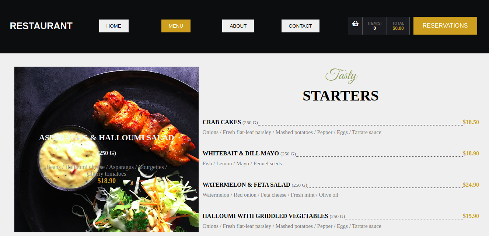

# Library

A Restaurant page developed using Javascript and and webpack as modules bundler

## Built With

- HTML,
- CSS,
- JavaScript,
- Webpck

## Live demo Link

[live link](https://rawcdn.githack.com/OdongAlican/alican-restaurant/036e7c0f75222c583ea6e74bdd5d4f2a404115a2/dist/index.html)

### Prerequisites

- Any kind of browser supporting CSS3 and HTML5

### Setup

- Fork the repo to your remote repository.
- Clone or download the repository to your local machine.

### Install

- No istallation required.

### Running the Project
- Access the index.html in the dist folder and open it in your browser.
- Change the various pages by clicking the nav bar links

## Author

👤 **Odong Sunday**

- [Portfolio](https://odongsunday.netlify.app/)
- Github: [@OdongAlican](https://github.com/OdongAlican)
- Twitter: [@odongsandie](https://twitter.com/odongsandie)
- Linkedin: [Sunday Alican odong](https://www.linkedin.com/in/sunday-alican-odong/)
- [Email](mailto:sandieo.2020@gmail.com)

## 🤝 Contributing

Contributions, issues and feature requests are welcome!

Feel free to check the [issues page](https://github.com/OdongAlican/Library/issues).

## Show your support

Give a ⭐️ if you like this project!
